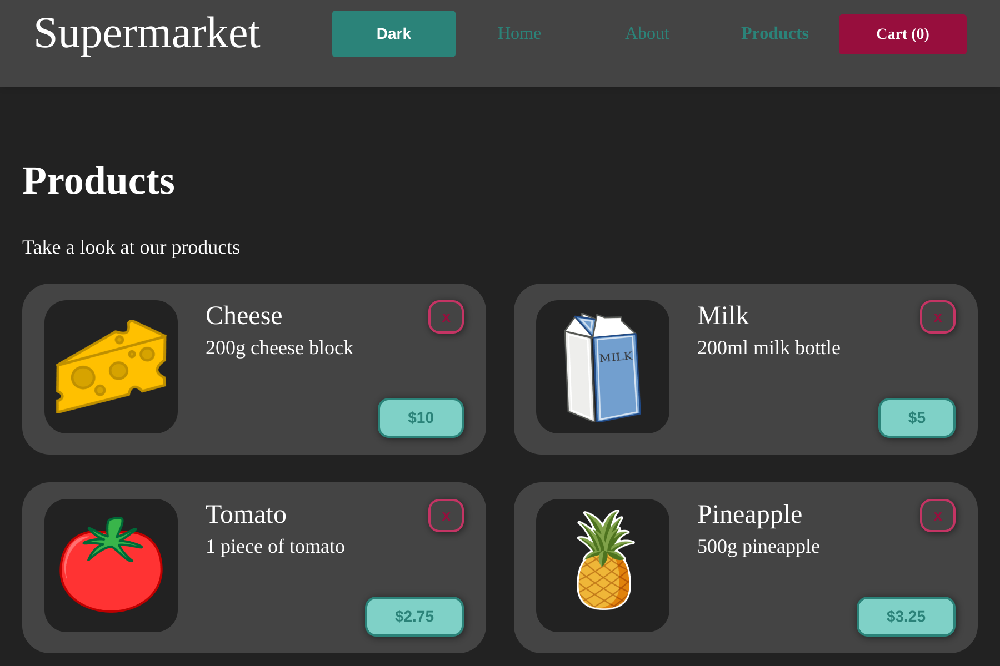

# Supermarket

A web store built with React. The website is deployed to [Netlify](https://www.netlify.com/) and can be found [here](https://adoring-snyder-52ad93.netlify.app/).



## A note on deployment
This project is hosted on [GitHub Pages](https://pages.github.com/), but as this is made with React,
there are some additional steps (build and deployment is not initiated per commit/push to upstream). To build and deploy the project, run the command

## Requirements

[Git](https://git-scm.com/), [node](https://nodejs.org/en/) and [npm](https://npm.community/) ([Node Version Manager](https://github.com/nvm-sh/nvm) is recommended for installing node and npm on macOS and Linux. [A similar manager](https://github.com/coreybutler/nvm-windows) is provided for Windows).

## How to set up (locally)

1. Clone this repository:

```bash
$ git clone https://github.com/nwnordahl/supermarket
```

2. Install the required packages in the cloned repository with npm:

```bash
$ npm i
```

3. Run server:

```bash
$ npm run start
```

## How to use

If you want to use it locally, make sure that you have done the steps above. Open your browser, and go to `localhost:3000`.

## Built with

- [React](https://github.com/facebook/react)
- [React Router](https://github.com/remix-run/react-router)

